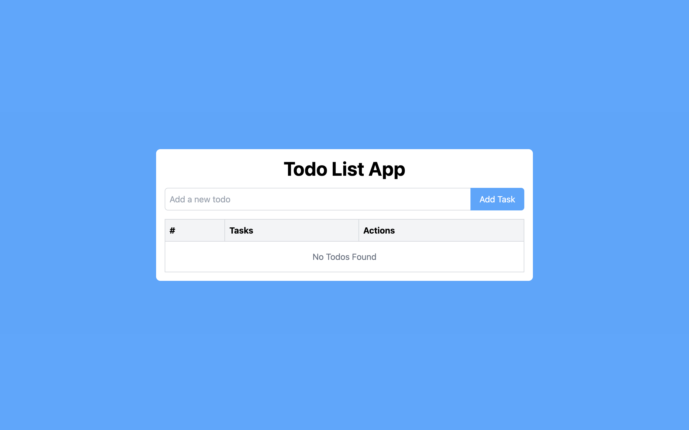

# Todo App

This is a **Todo App** built with **React** and **TypeScript**, utilizing **Vite** for fast builds and hot module replacement (HMR). The app allows users to create, edit, delete, and mark tasks as completed, with tasks persisting even after refreshing the page via **localStorage**.

## Features

- **Add Tasks:** Easily add tasks to your to-do list.
- **Edit Tasks:** Click to edit existing tasks.
- **Delete Tasks:** Remove tasks from your list.
- **Mark Tasks as Completed:** Check the checkbox to mark tasks as done.
- **Persist Tasks:** The tasks are saved in **localStorage**, so they remain after a page refresh.

## Technologies Used

- **React**: For building the UI and managing state.
- **TypeScript**: For static type checking and better developer experience.
- **Vite**: A fast build tool for modern web applications.
- **localStorage**: To store tasks persistently across page reloads.

## Preview

Here's a screenshot of the app in action:



## Getting Started

To run the app locally:

1. Clone the repository:
   ```bash
   git clone <your-repository-url>
   ```
